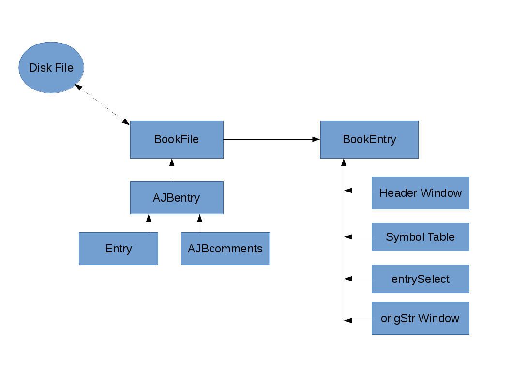

Theory of Operation
*******************

Overview
======== 

**ajbbooks** was written primarily to facilitate user input of entries
and to facilitate review of entries (proofreading) by letting the user
concentrate on the content of the entry rather than the formatting. In
addition, it needed to be able to read the already existing book lists
that had been produced with Word. Finally, it needed to write
out the text files in a consistent format so that all files are
similar in format and structure. This later point is particularly
important for files that would later be read into a database. The
older method, of formatting the files manually, was sure to introduce
inconsistencies between files.

The list of book entries created by **ajbbooks** will be used by other
programs to generate the database for the project.  Thus **ajbbooks**
doesn't care much about the actual content of fields. It just needs to know
how to parse and write the fields.

To achieve these goals **ajbbooks** maintains three different views of
a book list.  The first is the external comma separated text file of
entries called a DiskFile.  The second is the internal python class
BookFile. The third is the user's graphical view of a single entry
called BookEntry.  Various functions exist to transform from one view
to the other via the internal BookFile class. Thus BookFile knows how
to read/write the DiskFile while BookEntry knows how the read/write
the BookFile.

The three state view in shown in the first illustration while second shows
the the overall class structure in the views.

.. _three-state-diagram:

   The three different views of the book lists and entries.

.. _block-diagram:

   The block diagram of the class hierarchy.

The External BookFile Format
============================

A single text file, i.e. a BookFile, consists of a header section
followed by an unlimited number of entries.  The header section is
always at the start of the file and the first numbered line begins the
entries. Blank lines or lines that do not start with a number are
ignored when looking for entries. Currently all entries in a BookFile
are related by AJB volume, however, a BookFile is primarily just a
list of entries. The entries may or may not have a relationship with
each other.

The entries themselves have a very specific format but are basically a
single line with fields separated by commas. This format was chosen
to make parsing the entry easy with tools that I was familiar with at
the time. The fields were chosen to match the usual information within
the AJB.  However, this format rather quickly needed to be extended as
more variant entries were found.

The entry format fields are

   index AJB_number Author_list, Title, Place, PublisherName, 
   CopyrightYear, Pagination, Price_List, Review_List, Comments

and a typical entry looks like,

  7 59.111(0).09 Z. Kopal, Close Binary Systems, London,
  Chapman & Hall Ltd., 1959, 14+558 pp, $16.75,
  Proc. Phys. Soc. 75 942 and Publ ASP 71 552 and RH 40 199
  and Sky Tel. 18 699 and Sky Tel. 19 303,
  also published New York: John Wiley & Sons;

Field Definitions
-----------------

The first field contains three different pieces of information. the
index number is simply a count of the entries within the BookFile. The
AJB_number is the index number within the *Astronomischer
JahresBericht* consisting of the volume number, the section number, a
subsection number in parenthesis, and the entry number within the
section. The Author_list consists of a sequence of names separated by
'and'. If the Author_list contains 'ed.' or 'comp.' at the end of the
names then this is a list of editors or compilers rather than authors.

The second field is simply the title and any subtitle of the work.
The third field lists the place of publication while the fourth field
is the name of the publisher.  If the publisher is located in multiple
cities then the place names are connected by hyphens, e.g. New
York-London. The fifth field is the copyright year if known and the
sixth field is the page count.  The seventh field lists the prices in
whatever currency was given in the AJB. In the situation where a book was
published simultaneously in two or more different countries there may
be more that one price listed, in which case the prices are separated
by 'and'. The eighth field is a list of reviews also separated by
'and'. The reviews themselves have no particular format, though the
general standard is 'journalname volume (issue) page colon reviewer_name'.

The ninth field is a list of comments separated by a semi-colon.
Comments are where all the entry variations are kept.

Comment Definitions
-------------------

By late 2011 I had created six book files by hand using Microsoft Word
and Excel. As I progressed through the files I found various entries
that were not in a standard format. However, the additional
information was important to collect.  Rather than add additional
fields this information was put into the comments field with
particular keywords designating what the information pertained to.
For example, the first time I found both authors and editors listed
for a work I added a comment string 'edited by <name_list>'. The same
thing was done when I found compilers, contributors and translators.

In all, a total of eleven different comments strings have been defined which
are listed below

  1. edited by <name_list>
  2. compiled by <name_list>
  3. contributors <name_list>
  4. translated by <name_list>
  5. translated from <LanguageName>
  6. language <LanguageName>
  7. reference <AJB_number>
  8. reprint of <AJB_number>
  9. also published <PublisherList>
  10. edition <1st or 2nd or 3rd or 4th or 5th ...>
  11. other

Where <name_list> is of the form "name [and name [and ...]]" and name
is of the form "[FirstInitial] [MiddleInitials] last"; note that the
last name is required but the first initial and the middle ones are optional.
There may be multiple middle initials.

The grammar, in Extended Bachus-Naur format, is

=============  == ==================================================
First          =  Second
=============  == ==================================================
Comment        =  ( Edition | Compilers | Contributors | Reference | Reprint | Editors | Translation | Publishers | Language | Other );
Edition        =  [WhiteSpace], ( Digit | TwoDigit ), ( 'nd' | 'rd' | 'st' | 'th'), [( 'facsimile' | 'revised' )], 'edition', ';';
Compilers      =  [WhiteSpace], 'compiled by', NameList, ';', [WhiteSpace];
Contributors   =  [WhiteSpace], 'contributors', NameList, ';';
Reference      =  [WhiteSpace], 'reference', AJBNum, ';';
Reprint        =  [WhiteSpace], 'reprint of', ( AJBNum | Year ), ';';
Editors        =  [WhiteSpace], 'edited by', NameList, ';';
Translation    =  [WhiteSpace], 'translated', [FromLanguage], [ToLanguage], ['by', NameList], ';';
Publishers     =  [WhiteSpace], 'also published', PublisherList, ';';
Language       =  [WhiteSpace], 'in', LanguageList, ['with', uWords, 'references'], ';';
Other          =  [WhiteSpace], 'other', uWords, ';';
WhiteSpace     =  ? <RE> ?;
Digit          =  ? WORD('0-9') ?;
TwoDigit       =  ? WORD('0-9') ?;
NameList       =  Name, {Name};
AJBNum         =  'AJB', Volume, '.', Section, '.', Item;
Year           =  ? WORD('0-9') ?;
FromLanguage   =  'from', uWord;
ToLanguage     =  'into', uWord;
PublisherList  =  Publisher, {Publisher};
LanguageList   =  uWords, {uWords};
uWords         =  uWord, {uWord};
Name           =  [Initial, ['-', Initial]], [( Initial, ['-', Initial] ), {Initial, ['-', Initial]}], uWords;
Volume         =  TwoDigit;
Section        =  ? <RE> ?;
Item           =  ? <RE> ?;
uWord          =  ? <RE> ?;
Publisher      =  uWords, ':', uWords;
Initial        =  ? <RE> ?, '.';
=============  == ==================================================

The python package ``modgrammar`` is used to parse the comments using
the defined grammar. This version of **ajbbooks** uses modgrammar-0.10.
The code may be found at `pypi.python/org
<https://pypi.python.org/pypi/modgrammar/0.10>`_ and the documentation
can be found at `pythonhosted.org
<http://packages.python.org/modgrammar>`_

Internal BookFile Object
========================

The internal class BookFile is defined in bookfile.py. 

=================== == ======================================
=================== == ======================================
self._header        =  __defaultHeader__
self._entryList     =  []

self._volumeNumber  =  -1
self._fileName      =  './document1'
self._dirName       =  './'
self._baseName      =  'document1'

self.curEntryNumber =  -1
self._dirty         =  False
=================== == ======================================

The primary internal variables are ``_header`` and ``_entryList``,
which contain the header of the external disk file and the list of
entries respectively.  Entries are of the Class AJBentry, defined in
AJBentry.py.  Secondary variables are ``_volumeNumber``, the value to
outfall the volume number in a new entry; ``_fileName``, the pathname
for the disk file as passed to BookFile via the command line or menu item;
``_dirName``, the directory portion of _filename; ``_baseName``, the
base name of ``_fileName``; ``_curEntryNumber``, the number of the
current active entry in ``_entryList``, restricted to the range 1 <=
``_curEntryNumber`` <= len(``_entryList``); and ``_dirty``, indicating
that the internal BookFile has been modified since the last write to
disk. The class functions are detailed in the Classes section of this
manual.
 
The default header is

.. parsed-literal::

   '''
   Entry format

   Num AJB_ID Author [and author [and …]] [ed.|comp.], Title, Place,
   Publisher, year, description, price, review [and review [and …]],
   comments

   AJB_ID   volume.section[(subsection)].entry, for example 68.144(1).25
   would be volume 68, section 144, subsection 1, and entry number 25.

   Commas are field separators for automatic parsing.  Use the word
   ‘comma’ if you want the character in field string. We will use global
   search and replace after parsing into fields.

   Save as Unicode UTF-8 text encoding. Skip section 4 in Part 1

   For volume AJB ?? Index to the Literature of ????, started, finished,
   proofread
   '''

Reading and Writing Text Files
------------------------------

The BookFile class knows how to insert/delete/replace entries in the
``_entryList``, how to open/read/write disk files, how to read the
header of a disk file, and how to recognize an entry in the disk file.
When ever it needs to read/write an entry to/from the ``_entryList``,
it calls on the entry itself to handle this action.  Entries are of type
``Class AJBentry`` defined in AJBentry.py.

AJB Entries
-----------

The ``Class AJBentry`` is a subclass of ``Entry`` which is defined in
entry.py. A generic entry object is a python dictionary with the following
fields and default values.

======================== ===== ======================
 Entry[ 'Index']          =    -1                   
 Entry[ 'Num']            =    {'volNum' : -1,         
 \                       \     'sectionNum' : -1,      
 \                       \     'subsectionNum' : -1,   
 \                       \     'entryNum' :- 1,        
 \                       \     'entrySuf' : '',
 \                       \     'volume' : ''}         
 Entry[ 'Authors']        =     []                  
 Entry[ 'Editors']        =     []                        
 Entry[ 'Compilers']      =     []                  
 Entry[ 'Contributors']   =     []                  
 Entry[ 'Translators']    =     []                  
 Entry[ 'Others']         =     []                  
 Entry[ 'Title']          =     ''                  
 Entry[ 'Publishers']     =     []                  
 Entry[ 'Year']           =     ''                  
 Entry[ 'Pagination']     =     ''                  
 Entry[ 'Price']          =     ''                  
 Entry[ 'Reviews']        =     []                  
 Entry[ 'Comments']       =     ''                  
 Entry[ 'OrigStr']        =     ''                  
======================== ===== ======================

The AJBentry adds the following items to this dictionary to add
fields that are normally in the comments.

========================= ===== ======================
 Entry[ 'TranslatedFrom']  =     ''                  
 Entry[ 'Language']        =     ''                  
 Entry[ 'Reprint']         =     ''                  
 Entry[ 'Reference']       =     ''                  
========================= ===== ======================

Index is the entry number within the individual BookFiles. It is 
simply a running count of the number of books.

Num is the volume, section, and index within an *AJB* volume. It serves
to distinguish the book from any other within the *AJB* series.

Authors, Editors, Compilers, Contributors, and Translators are lists
of HumanName object defined in the third-party package nameparser.
This version of **ajbbooks** uses nameparser-0.3.3.
The code can be found at the `Project Home Page
<https://github.com/derek73/python-nameparser>`_ and the documentation
can be found on `nameparser.readthedocs.org <http://nameparser.readthedocs.org/en/latest/>`_

Others is a list of string. This strings contains the real comments
about the entry rather than the extra entry information.

Title is the name of the book. Note that many books has a sub-title as
well. The current structure does not distinguish this fact.  I use a semi-colon
between titles and sub-titles (as well as sub-sub-titles).

Publishers is a list of dictionaries with the location and name of the
publisher, {'Place': <placename>, 'PublisherName': <publisherName>}

Year contains the copyright date if known.

Pagination contains the page count of the preface and main text. The *AJB* may
indicate the number of tables and illustrations in addition to the page
count but those information are not included here.

Price is a simple string entry. More that one price will be separated 
by 'and'.

Reviews is a list of strings, each string containing a review reference.

Comments holds the original comment field.

OrigStr hold the original full text string.

TranslatedFrom is a simple string entry that indicates the language
of the original volume that this work is a translation of.

Language is a simple string entry. If an entry is written in more
than one language, the language names are separated by 'and'.  There
are occasional books published in Russian and English for example.

Reprint contains an *AJB* number. This entry is a reprint
of the entry at that *AJB* number.

Reference contains the *AJB* number of an entry, not necessarily in
this file, of which, this information should be appended or amended.

AJBentry Functions
------------------

The generic ``class entry(dict)`` defines empty read/write functions
as well as ``isValid()``.  Subclasses of ``entry`` must defined there own
read/write function to convert between the external BookFile format and the
internal class format. The ``isValid()`` function must return ``True`` for a
minimally valid entry. In the case of AJBentry this means that a books has at
least a title and an *AJB* number

Special Considerations
----------------------

Note that the external BookFile format for the book entries use commas
as field separators.  This implies that commas may not be used in
title strings, publisher names, comments, and other string
fields. However, commas frequently occur in such strings.  Commas are
legal in any of the AJBentry fields so we need to take special
precautions when reading/writing an external BookFile.  In particular
the class functions AJBentry::write() checks for commas in any string
and replaces them with the string ' comma '. Similarly the function
AJBentry::write() checks for ' comma ' in BookFile strings and
replaces them with the string ', ' in the AJBentry dictionary values.

The use of comma separated fields within a text based file is very
constraining when documenting books. Because of the design I am limited
in the amount and type of information I can store. Furthermore, extending
the design usually requires extensive code changes.  In future versions
of **ajbbooks** I hope to use XML as the external BookFile format.

Reading and Writing the Display
===============================

The ``class BookEntry`` defined in `mainWindow.py` handles menu and
button event as well as the main display for the books. This display
presents book information in a visual format that is easy for people
to read and process, see Figure 3.1.

designer
--------

QtDesigner 4.8 is used to build the window interfaces.  The ``ui`` files are
in the directory ``bookentry/designer``.

.. _symbol-table-theory:

symbol table
------------

The *AJB* covers the entire international field of astronomer and
astrophysics and therefore has titles and names in multiple languages
which many additional characters beyond the standard ASCII
codes. The internal and external formats are encoded
in UTF-8 rather than plain ASCII in order to deal with this issue.

Standard keyboards do not have all these additional characters and I did
not want to learn a large number of keyboard tricks in order to enter
these characters.  The solution was to build a symbol table modeled after
similar tables in advanced text editing programs.

The table was based on the charpicker.py package developed by Rich
Griswold. I found it at his blog
`http://richgriswold.wordpress.com/2009/10/17/character-picker/
<http://richgriswold.wordpress.com/2009/10/17/character-picker/>`_ but
that URL no longer appears to be valid. My symbol table code is
located in bookentry/symbol.py

Every time the symbol table is opened it reads the file
symbols.txt. The location of the symbols.txt file is found in
mainWindow.py by looking at the file name of the imported file
symbol.py. The string ``symbols.txt`` is appended to the directory
portion of this name and the resulting name is opened. This is not the
proper pythonic way of doing thing but it works for the time being.

The symbols.txt file is simply a list of characters with tool tips
separated by a comma.  The format of a file look like::

  #
  #
  # symbols.txt
  #  A symbol table for the symbol.py package under the BookEntry program
  #  6 Feb 2013 James R Fowler
  #
  #
  Ä, Capital letter A with diaeresis
  ä, Small letter a with diaeresis
  Å, Capital letter A with ring above
  å, Small letter a with ring above
  à, small letter a with grave
  á, small letter a with acute
  ç, Small letter c with cedilla
  Č, Capital letter C with caron
  č, Small letter c with caron
  ć, Small letter c with acute

  Ë, Capital letter E with diaeresis
  ë, Small letter e with diaeresis
  È, Capital letter E with grave
  É, Capital letter E with acute
  è, Small letter e with grave
  é, Small letter e with acute
  ě, Small letter e with caron
  ę, Small letter e with cedilla
  Ï, Capital letter I with diaeresis
  ï, Small letter i with diaeresis
  ì, Small letter i with grave
  í, Small letter i with acute
  î, Small letter i with caron

  Ň, Capital letter N with caron
  ň, Small letter n with caron
  Ö, Capital letter O with diaeresis
  ö, Small letter o with diaeresis
  ø, Small letter o with stroke
  ô, Small letter o with circumflex
  ò, Small letter o with grave
  ó, Small letter o with acute

  #
  # The End
  #

Comment lines begin with '#' and are ignored by the software.  Each
character is then used as the text image for a Qt button object with
the tip added as the tool tip.  A blank line in the symbols.txt
indicated the start of a new line in the window display. The action of
the button when it is clicked is to send the signal
``sigClicked(QString)`` with the character as the parameter in the
signal.

This signal in turn is caught in the BookEntry class (mainWindow.py)
and is connected to the insertChar() function.  This insertion
function changes on the fly whenever the focus changes in the
BookEntry window between the various LineEdit and TextEdit items.

