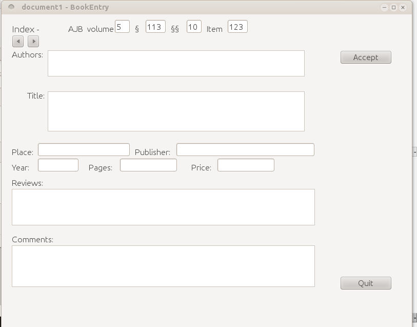

Operation
*********

The **BookEntry** program may be started from the command line with
the ``BookEntry.py`` command. The main display window looks like:

The main features are the top line with the Index number and the AJB
number along with the buttons to switch between existing records, the
main entry information from Authors to Comments, as well as the ``Save
Record``, ``New Entry``, ``Insert Entry``, and ``Delete Entry``
buttons on the right hand side.

Command Line Arguments
======================

BookEntry [-h] [-i filename] [-s filename] [-v integer]

  -h --help -- print this usage message and then exit

  -i --input filename -- open an existing file and reads the entries

  -s --symbols filename -- open an alternate symbol table

  -v --volume volnum -- default volume number for new entries

Menus
=====

Many of the menus are standard and should be familar to most users.  

File
----

**New File**: Create a new bookfile and display a blank entry ready
for editing. If a file has previously opened and records saved to it
or if the current entry has been modified a dialog box will pop up
asking if you wish to save the entry and the existing file before
opening the new file

**Open File**: Selecting the Open option brings up a file section
dialog box that allows one to select an existing file. The file name
will be displayed in the window title bar. Files are opened either to
check the entries in the file or to add additional entries to the
file.  The form will display the last entry. Simply click the ``New
Entry`` button to bring up a blank entry item to be filled
in. Alternatively use the ``Next`` and ``Previous`` buttons under the
``Index`` number to step through the records in order verify the
records have been properly entered. If a file has previously opened
and records saved to it or if the current entry has been modified a
dialog box will pop up asking if you wish to save the entry and the
existing file before opening the new file

**Save File**: If the entries were opened through an existing file
either via the command line or the **Open File** menu item, then write
the existing entries to that file.  If the entries are a new file,
then open the save-as dialog to get the new file name.

**Save File As**: Bring up a dialog box requesting a file name in
which to save the existing entries.  If the file already existed, the
user will be asked for confirmation before overwriting the file.

**New Entry**: Generates a new entry in the display and fills in the
Volume number if the default volume number is defined. See the section
Command Line Flags. The user is asked to save the current entry if it
has been modified.

**Save Entry**: Save the current entry in the display to the list of
entries in the bookfile class.

**Print Entry**:

**Quit**: Close the window and quits the application.  If there are
unsaved changes to the entries or the file the user will be asked to
save the changes first.

Edit
----

**Cut**: This menu item is disabled. The Cut/Copy/Paste menu in any of
the text or line items may be brought up with the right mouse button.
 
**Copy**: This menu item is disabled. The Cut/Copy/Paste menu in any
of the text or line items may be brought up with the right mouse
button.

**Paste**: This menu item is disabled. The Cut/Copy/Paste menu in any
of the text or line items may be brought up with the right mouse
button.

**Insert Symbol**: Brings up a window with a list of non-ASCII
charactors.  By clicking on a charactor it will be inserted into the
currently active text or line entry box at the current cursor
location.  No action occurs if the focus is currently held by
something other than a text or line entry item.

**Edit Header**: Brings up a text entry box in a separate window so
that one can edit the header lines in the book file.

**Show Original String**: Bring up a text window with the original string
entry.  This is only valid if the entry was read from a file.

Help
----

**About BookEntry**: brings up a dialog box with basic information
about the program, the author, and the run-time environment.

Buttons
=======

Save Record
-----------

New Entry
---------

Insert Record
-------------

Delete Record
-------------

Quit
----

