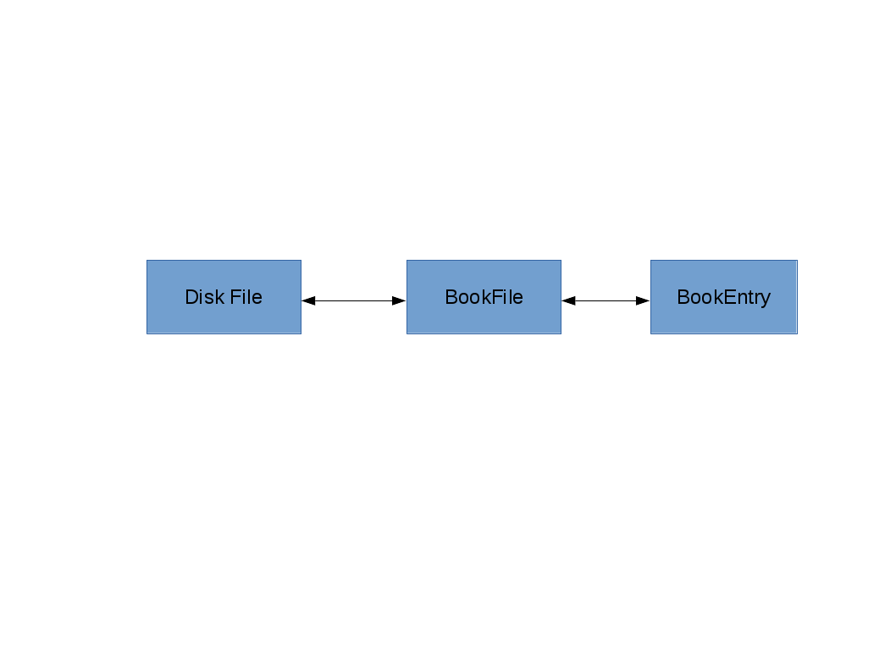
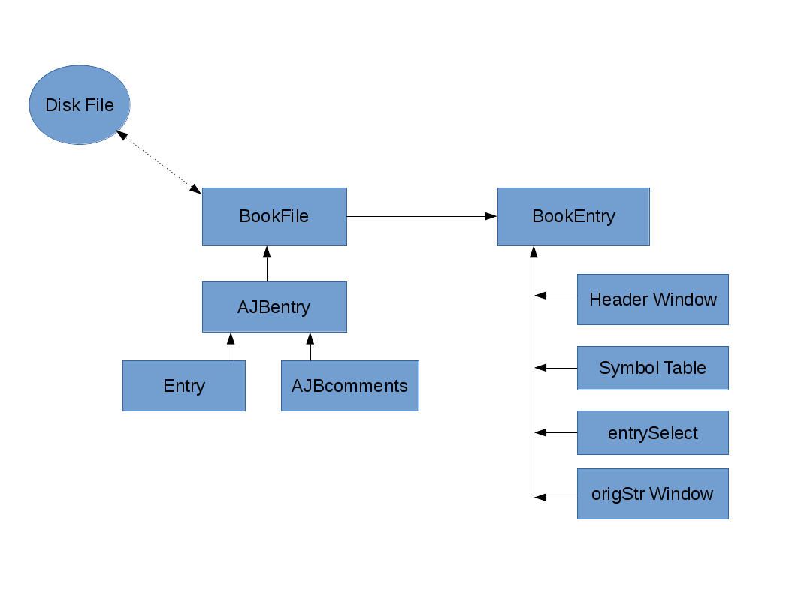

Theory of Operation
*******************

Overview
======== 

**ajbbooks** was written primarily to facilitate user input of entries
and to facilitate review of entries (proofreading) by letting the user
concentrate on the content of the entry rather than the formatting. In
addition it needed to be able to read the already existing book lists
that had been produced with a text editor. Finally it needs to writes
out the text files in a consistent format so that all files are
similar in format and structure. This later point is particularly
important for files that would later be read into a database. The
older method of formatting the files manually was sure to introduce
inconsistence between files.

The list of book entries created by **ajbbooks** will be used by other
programs to generate the database for the project.  Thus **ajbbooks**
doesn't care much about the actual content of fields. It just needs to know
how to parse and write the fields.

To achieve these goals **ajbbooks** maintains three different views of
a book list.  The first is the external comma separated list of
entries called an Disk File.  The second is the internal python class
BookFile. The third is the users graphical view of a single entry
called BookEntry.  Various functions exist to transform from one view
to the other via the internal BookFile class.

The three state view in shown in the first illustration while second shows
the the overall class structure in the views.

.. _three-state-diagram:

   The three different views of the book lists and entries.

.. _block-diagram:

   The block diagram of the class hierarchy.

The External BookFile Format
============================

A single text file, i.e. a BookFile, consists of a header section
followed by an unlimited number of entries.  The header section is
always at the start of the file and the first numbered line begins the
entries. Blank lines or lines that do not start with a number are
ignored when looking for entries. Currently all entries in a BookFile
are related by AJB volume, however, a BookFile is primarily just a
list of entries. The entries may or may not have a relationship with
each other.

The entries themselves have a very specific format but are basicly a
single line with fields separated by commas. This format was chosen
to make parsing the entry easy with tools that I was familar with at
the time. The fields were chosen to match the usual information within
the AJB.  However, this format rather quickly needed to be extended as
more varient entries were found.

The entry format fields are

   index AJB_number Author_list, Title, Place, PublisherName, 
   CopyrightYear, Pagination, Price_List, Review_List, Comments

and a typical entry looks like,

  7 59.111(0).09 Z. Kopal, Close Binary Systems, London,
  Chapman & Hall Ltd., 1959, 14+558 pp, $16.75,
  Proc. Phys. Soc. 75 942 and Publ ASP 71 552 and RH 40 199
  and Sky Tel. 18 699 and Sky Tel. 19 303,
  also published New York: John Wiley & Sons;

Field Definitions
-----------------

The first field contains three different pieces of information. the
index number is simply a count of the entries within the BookFile. The
AJB_number is the index number within the *Astronomischer
JahresBericht* consisting of the volume number, the section number, a
subsection number in parenthesis, and the entry number within the
section. The Author_list consists of a sequence of names separated by
'and'. If the Author_list contains 'ed.' or 'comp.' at the end of the
names then this is a list of editors or compilers rather than authors.

The second field is simply the title and any subtitle of the work.
The third field lists the place of publication while the fourth field
is the name of the publisher.  If the publisher is located in multiple
cities then the place names are connected by hyphens, e.g. New
York-London. The fifth field is the copyright year if known and the
sixth field is the page count.  The seventh field is the prices in
whatever currency was listed. In the situation where a book was
published simultaneously in two or more different countries there may
be more that one price listed, in which case the prices are separated
by 'and'. The eighth field is a list of reviews also separated by
'and'. The reviews themselves have no particular format, though the
general standard is 'journalname volume (issue) page colon reviewer name'.

The ninth field is a list of comments separated by a semi-colon.
Comments are where all the entry variations are kept.

Comment Definitions
-------------------

By late 2011 I had created six book files by hand using Microsoft Word
and Excel. As I progressed through the files I found various entries
that were not in a standard format and that included addtional
information that I wanted to collect.  Rather than add additional
fields this information was put into the comments field with
particular keywords designating what the information pertained to.
For example, the first time I found both authors and editors listed
for a work I added a comment string 'edited by <name_list>'. The same
thing was done when I found compilers, contributers and translators.

In all, a total of eleven different comments strings have been defined which
are listed below

  1. edited by <name_list>
  2. compiled by <name_list>
  3. contributors <name_list>
  4. translated by <name_list>
  5. translated from <LanguageName>
  6. language <LanguageName>
  7. reference <AJB_number>
  8. reprint of <AJB_number>
  9. also published <PublisherList>
  10. edition <1st or 2nd or 3rd or 4th or 5th ...>
  11. other

The grammer, in Extended Bachus-Naur format, is

=============  == ==================================================
First          =  Second
=============  == ==================================================
Comment        =  ( Edition | Compilers | Contributors | Reference | Reprint | Editors | Translation | Publishers | Language | Other );
Edition        =  [WhiteSpace], ( Digit | TwoDigit ), ( 'nd' | 'rd' | 'st' | 'th'), [( 'facsimile' | 'revised' )], 'edition', ';';
Compilers      =  [WhiteSpace], 'compiled by', NameList, ';', [WhiteSpace];
Contributors   =  [WhiteSpace], 'contributors', NameList, ';';
Reference      =  [WhiteSpace], 'reference', AJBNum, ';';
Reprint        =  [WhiteSpace], 'reprint of', ( AJBNum | Year ), ';';
Editors        =  [WhiteSpace], 'edited by', NameList, ';';
Translation    =  [WhiteSpace], 'translated', [FromLanguage], [ToLanguage], ['by', NameList], ';';
Publishers     =  [WhiteSpace], 'also published', PublisherList, ';';
Language       =  [WhiteSpace], 'in', LanguageList, ['with', uWords, 'references'], ';';
Other          =  [WhiteSpace], 'other', uWords, ';';
WhiteSpace     =  ? <RE> ?;
Digit          =  ? WORD('0-9') ?;
TwoDigit       =  ? WORD('0-9') ?;
NameList       =  Name, {Name};
AJBNum         =  'AJB', Volume, '.', Section, '.', Item;
Year           =  ? WORD('0-9') ?;
FromLanguage   =  'from', uWord;
ToLanguage     =  'into', uWord;
PublisherList  =  Publisher, {Publisher};
LanguageList   =  uWords, {uWords};
uWords         =  uWord, {uWord};
Name           =  [Initial, ['-', Initial]], [( Initial, ['-', Initial] ), {Initial, ['-', Initial]}], uWords;
Volume         =  TwoDigit;
Section        =  ? <RE> ?;
Item           =  ? <RE> ?;
uWord          =  ? <RE> ?;
Publisher      =  uWords, ':', uWords;
Initial        =  ? <RE> ?, '.';
=============  == ==================================================

Internal Bookfile Object
========================

The internal class BookFile is defined in bookfile.py. 

=================== == ======================================
=================== == ======================================
self._header        =  __defaultHeader__
self._entryList     =  []

self._volumeNumber  =  -1
self._fileName      =  './document1'
self._dirName       =  './'
self._baseName      =  'document1'

self.curEntryNumber =  -1
self._dirty         =  False
=================== == ======================================

The primary internal variables are ``_header`` and ``_entryList``,
which contain the header of the external disk file and the list of
entries respectively.  Entries are of the Class AJBentry, defined in
AJBentry.py.  Secondary variables are ``_volumeNumber``, the value to
autofill the volume number in a new entry; ``_fileName``, the pathname
for the disk file as passed to BookFile via the command line or menu;
``_dirName``, the directory portion of _filename; ``_baseName``, the
base name of ``_fileName``; ``_curEntryNumber``, the number of the
current active entry in ``_entryList``, restricted to the range 1 <=
``_curEntryNumber`` <= len(``_entryList``); and ``_dirty``, indicating
that the internal BookFile has been modified since the last write to
disk. The class functions are detailed in the Classes section of this
manual.
 
The default header is

.. parsed-literal::

   '''
   Entry format

   Num AJB_ID Author [and author [and …]] [ed.|comp.], Title, Place,
   Publisher, year, description, price, review [and review [and …]],
   comments

   AJB_ID   volume.section[(subsection)].entry, for example 68.144(1).25
   would be volume 68, section 144, subsection 1, and entry number 25.

   Commas are field separators for automatic parsing.  Use the word
   ‘comma’ if you want the character in field string. We will use global
   search and replace after parsing into fields.

   Save as Unicode UTF-8 text encoding. Skip section 4 in Part 1

   For volume AJB ?? Index to the Literature of ????, started, finished,
   proofread
   '''

Reading and Writing Text Files
------------------------------

The BookFile class knows how to insert/delete/replace entries in the
``_entryList``, how to open/read/write disk files, how to read the
header of a disk file, and how to recognize an entry in the disk file.
When ever it needs to read/write an entry to/from the ``_entryList``,
it calls on the entry itself to handle this action.  Entries are of type
``Class AJBentry`` defined in AJBentry.py.

The ``Class AJBentry`` is a subclass of ``Entry`` which is defined in
entry.py. A generic entry object is a python dictionary with the following
fields and default values.

======================== ===== ======================
 Entry[ 'Index']          =    -1                   
 Entry[ 'Num']            =    {'volNum' : -1,         
 \                       \     'sectionNum' : -1,      
 \                       \     'subsectionNum' : -1,   
 \                       \     'entryNum' :- 1,        
 \                       \     'entrySuf' : '',
 \                       \     'volume' : ''}         
 Entry[ 'Authors']        =     []                  
 Entry[ 'Editors']        =     []                        
 Entry[ 'Compilers']      =     []                  
 Entry[ 'Contributors']   =     []                  
 Entry[ 'Translators']    =     []                  
 Entry[ 'Others']         =     []                  
 Entry[ 'Title']          =     ''                  
 Entry[ 'Publishers']     =     []                  
 Entry[ 'Year']           =     ''                  
 Entry[ 'Pagination']     =     ''                  
 Entry[ 'Price']          =     ''                  
 Entry[ 'Reviews']        =     []                  
 Entry[ 'Comments']       =     ''                  
 Entry[ 'OrigStr']        =     ''                  
======================== ===== ======================

The AJBentry adds the following items to this dictionary to add
fields that are normally in the comments.

========================= ===== ======================
 Entry[ 'TranslatedFrom']  =     ''                  
 Entry[ 'Language']        =     ''                  
 Entry[ 'Reprint']         =     ''                  
 Entry[ 'Reference']       =     ''                  
========================= ===== ======================

Publishers is a list of dictionaries with the location and name of the
publisher, {'Place': <placename>, 'PublisherName': <publisherName>}

Authors, Editors, Compilers, Contributors, and Translators
are lists of HumanName object defined in the third-party package
nameparser.  Give link!

Comments holds the original comment field.

OrigStr hold the original full text string.

Reprint contains the AJB number. This entry is a reprint
of the entry at that AJB number.

Reference contains that AJB number of an entry, not necessarily in
this file, of which, this information should be appended or ammended.

Reviews is a list of strings, each string containing a review reference.

Others is a list of string. This strings contains the real comments
about the entry rather than the extra entry information.

Price is a simple string entry. More that one price will be separated 
by 'and'.

Language is a simple string entry. If an entry is written in more
than one language, the language names are separated by 'and'.  There
are occasional books published in Russian and English for example.

Reading and Writing the Display
===============================

designer
--------

.. _symbol-table-theory:

symbol table
------------

header
------
