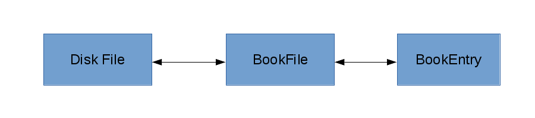

Theory of Operation
*******************

Overview
======== 

**ajbbooks** was written primarily to facilitate user input of entries
and to facilitate review of entries (proofreading) by letting the user
concentrate on the content of the entry rather than the formatting. In
addition it needed to be able to read the already existing book lists
that had been produced with a text editor. Finally it writes out the
text files in a consistent format so that all files are similar in
format and structure. This later point is particularly important for
files that would later be read into a database. The older method of
formatting the files manually was sure to introduce inconsistence
between files.

The BookFile Format
===================

A single text file, i.e. a BookFile, consists of a comment section
followed by a number of entries.  The comment section is always at the
start of the file and the first numbered line begins the
entries. Currently all entries in a BookFile are related by AJB
volume, however, a BookFile is primarily just a list of entries. The
entries may or may not have a relationship with each other.

The entries themselves have a very specific format but are basicly a
set of fields in a comma separated single line. This format was chosen
to make parsing the entry easy with tools that I was familar with at
the time. The fields were chosen to match the usual information within
the AJB.  However, this format rather quickly needed to be extended as
more varient entries were found.

The entry format fields are

   index AJB_number Author_list, Title, Place, PublisherName, 
   CopyrightYear, Pagination, Price_List, Review_List, Comments

and a typical entry looks like,

  7 59.111(0).09 Z. Kopal, Close Binary Systems, London,
  Chapman & Hall Ltd., 1959, 14+558 pp, $16.75,
  Proc. Phys. Soc. 75 942 and Publ ASP 71 552 and RH 40 199
  and Sky Tel. 18 699 and Sky Tel. 19 303,
  also published New York: John Wiley & Sons;

Field Definitions
-----------------

The first field contains three different pieces of information. the
index number is simply a count of the entries within the BookFile. The
AJB_number is the index number within the *Astronomischer
JahresBericht* consisting of the volume number, the section number, a
subsection number in parenthesis, and final the entry number within
the subsection. The Author_list consists of a sequence of names
separated by 'and'. If the Author_list contains 'ed.' at the end of
the names then this is a list of editors rather than authors.

The second field is simply the title and any subtitle of the work.
The third field lists the place of publication while the fourth field
is the name of the publisher.  If the publisher is located in multiple
cities then the place names are connected by hyphens, e.g. New
York-London. The fifth field is the copyright year if known and the
sixth field is the page count.  The seventh field is the prices in
whatever currency was listed.  In the situation where a book was
published simultaneously in two or more different countries than more
that one price might be listed in which case the prices are separated
by 'and'. The eighth field is a list of reviews also separated by 'and'.

The ninth field is a list of comments separated by a semi-colon.
Comments are where all the entry variation is kept.

Comment Definitions
-------------------

By late 2011 I had created six book files by hand using Microsoft Word
and Excel. As I progressed through the files I found various entries
that were not in a standard format and that included addtional
information that I wanted to collect.  Rather than add additional
fields this information was put into the comments field with
particular keywords designating what the information pertained to.
For example, the first time I found both authors and editors listed for
a work I added a comment string 'edited by <name_list>'. Similarly when I
found compilers, contributers and translators.

In all a total of eleven different comments strings have been defined which
are listed below

  1. edited by <name_list>
  2. compiled by <name_list>
  3. contributors <name_list>
  4. translated by <name_list>
  5. translated from <LanguageName>
  6. language <LanguageName>
  7. reference <AJB_number>
  8. reprint of <AJB_number>
  9. also published <PublisherList>
  10. edition <1st or 2nd or 3rd or 4th or 5th ...>
  11. other

The grammer in Extended Bachus-Naur format is

=============  == ==================================================
First          =  Second
=============  == ==================================================
Comment        =  ( Edition | Compilers | Contributors | Reference | Reprint | Editors | Translation | Publishers | Language | Other );
Edition        =  [WhiteSpace], ( Digit | TwoDigit ), ( 'nd' | 'rd' | 'st' | 'th'), [( 'facsimile' | 'revised' )], 'edition', ';';
Compilers      =  [WhiteSpace], 'compiled by', NameList, ';', [WhiteSpace];
Contributors   =  [WhiteSpace], 'contributors', NameList, ';';
Reference      =  [WhiteSpace], 'reference', AJBNum, ';';
Reprint        =  [WhiteSpace], 'reprint of', ( AJBNum | Year ), ';';
Editors        =  [WhiteSpace], 'edited by', NameList, ';';
Translation    =  [WhiteSpace], 'translated', [FromLanguage], [ToLanguage], ['by', NameList], ';';
Publishers     =  [WhiteSpace], 'also published', PublisherList, ';';
Language       =  [WhiteSpace], 'in', LanguageList, ['with', uWords, 'references'], ';';
Other          =  [WhiteSpace], 'other', uWords, ';';
WhiteSpace     =  ? <RE> ?;
Digit          =  ? WORD('0-9') ?;
TwoDigit       =  ? WORD('0-9') ?;
NameList       =  Name, {Name};
AJBNum         =  'AJB', Volume, '.', Section, '.', Item;
Year           =  ? WORD('0-9') ?;
FromLanguage   =  'from', uWord;
ToLanguage     =  'into', uWord;
PublisherList  =  Publisher, {Publisher};
LanguageList   =  uWords, {uWords};
uWords         =  uWord, {uWord};
Name           =  [Initial, ['-', Initial]], [( Initial, ['-', Initial] ), {Initial, ['-', Initial]}], uWords;
Volume         =  TwoDigit;
Section        =  ? <RE> ?;
Item           =  ? <RE> ?;
uWord          =  ? <RE> ?;
Publisher      =  uWords, ':', uWords;
Initial        =  ? <RE> ?, '.';
=============  == ==================================================

split read/write of text file and the user display
use intermediary BookFile class to hold results
notion of separate dirty flags for BookFile and display
explain details

ajbbooks has 3 views of the book list, a text based csv file format, a
python dictionary class BookFile, and the visual display for user
interaction.  Various pieces of python software exist between these view
to facilitate conversion between formats.  

Overall view
diagram, text files, dictionary entries, gui
3 state view

Description of the detail 

Reading and Writing Text Files
==============================

makes use of nameparser package and modgrammer package.

Reading and Writing the Display
===============================
 pyqt
 designer
 symbol table
 header

