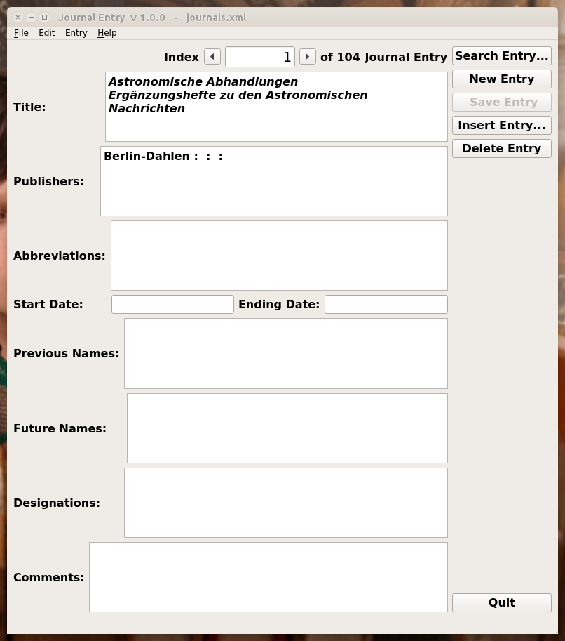
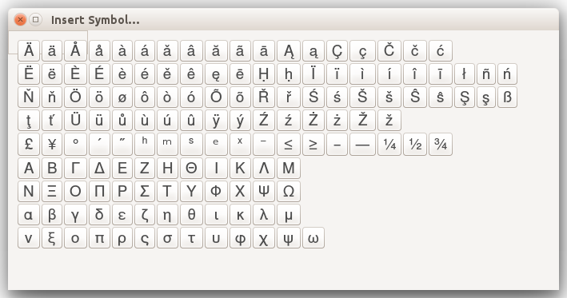
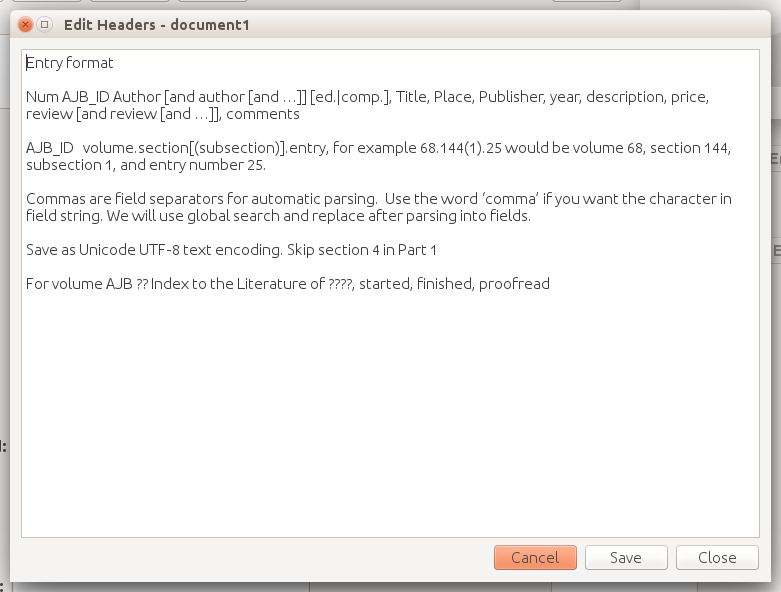
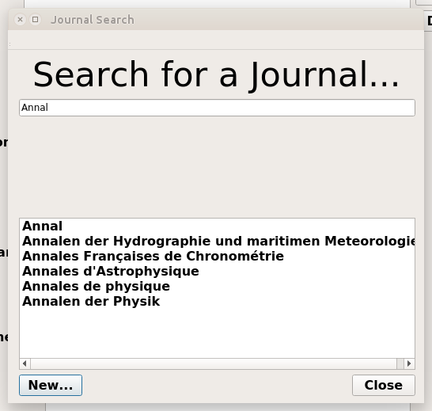

..  Begin copyright
.. 
..   /home/jrf/Documents/books/Books20/Tools/python/doc/journals/operation.rst
..   
..    Part of the Books20 Project
.. 
..    Copyright 2016 James R. Fowler
.. 
..    All rights reserved. No part of this publication may be
..    reproduced, stored in a retrival system, or transmitted
..    in any form or by any means, electronic, mechanical,
..    photocopying, recording, or otherwise, without prior written
..    permission of the author.
.. 
.. 
..  End copyright

Operation
*********

The **journals** program may be started from the command line with
the ``journals`` command. The main display window is shown in figure 3.1.

The principal features are the top line with the Index number along
with the buttons to switch between existing records, the main entry
information from Authors to Comments, as well as the ``Search
Entry...``, ``Save Entry``, ``New Entry``, ``Insert Entry``,
``Delete Entry``, and ``Quit`` buttons on the right hand side.

Command Line Arguments
======================

journals [-h] | [-V] | [-i filename] [-s filename] [-v integer]

  -h, --help -- print this usage message and then exit

  -V, --version -- provide version information and then exit

  -i, --input filename -- open an existing file and reads the entries

  -s, --symbols filename -- open an alternate symbol table

  -c CONFIG, --config CONFIG -- use alternate configuration file name

   The main display window of journals.

Menus
=====

Many of the menus are standard and should be familiar to most users.  

File
----

**New File <Ctrl-N>**: Create a new journalfile and display a blank entry ready
for editing. If a file has been previously opened and records saved to it
or if the current entry has been modified, a dialog box will pop up
asking if you wish to save the entry and the existing file before
opening the new file

**Open File <Ctrl-O>**: Selecting the Open option brings up a file
selection dialog box that allows the users to select an existing
file. The file name will be displayed in the window title bar. Files
are opened either to check the entries in the file or to add
additional entries to the file.  The form will display the first
entry. Simply click the ``New Entry`` button to bring up a blank entry
item to be filled in. Alternatively use the ``Next`` and ``Previous``
buttons next to the ``Index`` number to step through the records in
order If a file has been previously opened and records saved to it or
if the current entry has been modified, a dialog box will pop up
asking if you wish to save the entry and the existing file before
opening the new file

**Save File <Ctrl-S>**: If the entries were opened through an existing
file either via the command line or the **Open File** menu item, then
write the existing entries to that file.  If the entries are a new
file, then open the Save-as dialog to get the new file name.

**Save File As <Ctrl-A>**: Bring up a dialog box requesting a file
name in which to save the existing entries.  If the file already
existed, the user will be asked for confirmation before overwriting
the file.

**Quit <Ctrl-Q>**: Close the window and quits the application.  If
there are unsaved changes to the entries or the internal bookfile
object, the user will be asked to save the changes first.

Edit
----

**Cut <Ctrl-X>**: This menu item is disabled. The Cut/Copy/Paste menu
in any of the text or line items may be brought up with the right
mouse button.
 
**Copy <Ctrl-C>**: This menu item is disabled. The Cut/Copy/Paste menu
in any of the text or line items may be brought up with the right
mouse button.

**Paste <Ctrl-V>**: This menu item is disabled. The Cut/Copy/Paste
menu in any of the text or line items may be brought up with the right
mouse button.

**Insert Symbol... <Ctrl-I>**: Brings up a window with a list of
commonly used Unicode characters.  By clicking on a character it will
be inserted into the currently active text or line entry box at the
current cursor location.  No action occurs if the focus is currently
held by something other than a text or line entry item.

**Edit Header... <Ctrl-H>**: Brings up a text entry box in a separate
window so that one can edit the header lines in the book file.

Entry
-----

**New Entry <Ctrl-E>**: Generates a new entry in the display. The user
is asked to save the current entry if it has been modified.

**Save Entry <Ctrl-R>**: Save the current entry in the display to the list of
entries in the journalfile object.

**Insert Entry**: Open the insert selection dialog. Clicking on the line
with the index of the entry will insert the current entry into the list
before the entry selected.

**Delete Entry <Ctrl-D>**: Delete the displayed entry from the
internal journalfile object. A dialog box will appear to confirm that you
want to delete this entry.

**Print Entry <Ctrl-P>**: Will print a screen dump of the entry window.
This is not implemented right now.

Help
----

**About Journals**: brings up a dialog box with basic information
about the program, the author, and the run-time environment.

Buttons
=======

Search Entry...
---------------

Open the search dialog in order to see if an entry already exists
or to edit an existing entry. See :ref:`search-dialog`.

Save Entry
-----------

Save the current on-screen entry to the internal list of
entries at the current index number

Insert Entry
-------------

Insert the entry on the screen at a new location in the internal
journalfile object.  A dialog window will be displayed with the titles
of the existing entries. Highlight an entry and click the **Ok**
button or double-click the entry to insert a copy of the existing
entry into the internal journalfile object before the highlighted entry.

Delete Entry
-------------
Delete the displayed entry from the internal list. A dialog box will
appear to confirm that you want to delete this entry.

Quit
----

Close the window and quits the application.  If there are unsaved
changes to the entries or the internal list the user will be asked to
save the changes first.

Symbol Table
============

The symbol table is illustrated in figure 3.2.  It can be displayed by
selecting the **Insert Symbol** item in the **Edit** menu or use the
keyboard shortcut **Cntr-I**. This brings up a window as shown below.
Clicking on any letter will insert that letter in the current field at
the current location of the cursor. See the section :ref:`symbol-table-theory`
for information about adding new symbols.

   The Insert Symbol table window.

Header Edit
===========

The file header contains information about the entries in the file and
may be edited via the Header Edit window.  This window is illustrated
in figure 3.3 and may be shown by selecting the **Edit Header** in the
**Edit** menu or by typing the keyboard shortcut **Ctrl-H**.

   The Header Edit window.

   
.. _search-dialog:
   
Search Entry
============

The Search Entry dialog allows the user to type a partial title and
see a list of titles that might match the desired one. The search
string is limited to 10 charactors so any typing beyond that will not
change the results.  Double-clicking an entry in the title list
to bring up that entry in the main entry window.

   The Search Entry dialog
   

Config File
===========

The configuration file is used to define the locations and
values of various parameters. At this time the primary use
is to show the location of journalFile.xsd file. This files defines
the formatting for a journal XML file and is required when reading a
new XML file in order to verify the syntax of the file.  It is also
possible to define the location of the working journal XML file as well.

The program used the ``configparser`` package which comes with python.
Thus the format of the file is similar to a .ini file.

The default configuration file is in ``./journal.conf``.

My current configuration file is::
  
  [DEFAULT]
  journal_file_dir = /home/jrf/Documents/books/Books20/Data
  journal_file_name = journals
  journal_file_ext = xml
  journal_xsd = /home/jrf/Documents/books/Books20/Tools/bookentry/xml/journalfile.xsd

