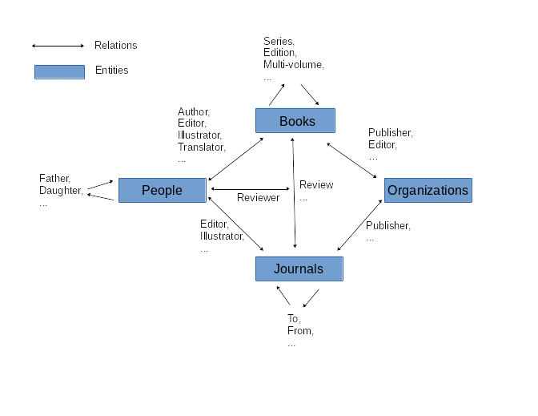

Introduction
************

At the beginning of the project I wrote a note about Database Design.
This was a simple document created without a lot of thought and
it does not explain a lot of detail about what might be needed in
a database for the project.  I have learned a little bit more in the
intervening years this document is the result.

Next Section
************

Should we use an SQl or a noSQL database?  Choices would be between
SQLite or mondoDB.  I like the SQL databases for the formal orgainization
that they provide. The noSQL database provides the ability to add new
columns or data to the system with out having the rebuild the database.
``Task; Read about SQLite and mongoDB.``

Independent of the style of the database there are certain actions
that any software system would have to support.  We need to be able to
``insert`` a new record (either a full or partial record), ``update``
an existing record with new or revised data, ``delete`` a record
and any associated records in other tables, and finally ``read`` full
or partial data about a record.

High level records are books, journals, people, and organizations. These
all have relationships to each other. The following illustration
shows the high level entities and some possible relations between
them.

May want to track queries in order to run analytics later on.

Sample Queries
**************

To plan the database we need to define the expected queries
that we might want to run.  This will have define what tables
are needed.

  Q1. Show all information about Book|Person|Journal|Organization XXX

  Q2. Select all books by author A.

  

Development
***********

As an initial test I have developed a strawman database using the
informatino in the journals.xml files. There are about 230 journals
with associated information as well as some publishers in this
file.

