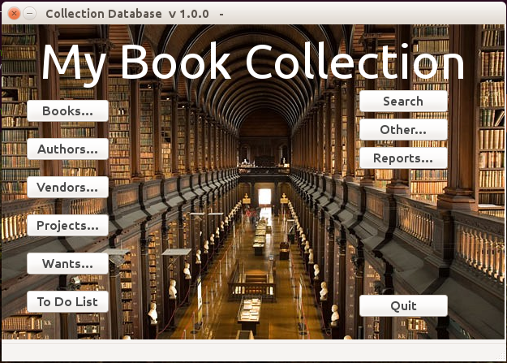

Operations
**********

The **library** program may be started from the command line
with the ``library`` command. The default collection database
is ??? but this may be changed on the command line. The main display window
is shown in Figure 3.1.

Although primarily a collection of books, **library** also allows
searching by Author, Vendor, Publisher, Projects

Command Line Arguments
======================

Start the program by running 
 
library [-h] [-V] [-d DATABASE] [-s SYMBOL]

  -h, --help -- print this usage message and then exit

  -V, --version -- provide version information and then exit

  -d DATABASE, --database=DATABASE -- open an existing file and read the entries

  -s SYMBOLS, --symbols SYMBOLS -- open an alternate symbol table

	    The main window for the Library program

Menus
=====

Many of the menus are standard and should be familiar to most users.  

File
----

**Quit <Ctrl-Q>**: Quit the program. You will be asked if you wish to
save any unsaved edits.

Edit
----

**Cut <Ctrl-X>**: This menu item is disabled. The Cut/Copy/Paste menu in any of
the text or line items may be brought up with the right mouse button.
 
**Copy <Ctrl-C>**: This menu item is disabled. The Cut/Copy/Paste menu in any
of the text or line items may be brought up with the right mouse
button.

**Paste <Ctrl-V>**: This menu item is disabled. The Cut/Copy/Paste menu in any
of the text or line items may be brought up with the right mouse
button.

**Insert Symbol... <Ctrl-I>**: Brings up a window with a list of
commonly used Unicode characters.  By clicking on a character it will
be inserted into the currently active text or line entry box at the
current cursor location.  No action occurs if the focus is currently
held by something other than a text or line entry item.

View
----

**Books...**: Open the Books List window, Same as the **Books...**
button on main window.

**Authors...**: Open the Authors List window, Same as the **Authors...**
button on main window.

**Vendors...**: Open the Vendors List window, Same as the **Vendors...**
button on main window.

**Projects...**: Open the Projects List window, Same as the **Projects...**
button on main window.

**Wants...**: Open the Wants List window, Same as the **Wants...**
button on main window.

**To Do List...**: Open the To Do List window, Same as the **To Do List...**
button on main window.

**Search...**: Open the Search window, Same as the **Search...**
button on main window.

**Other...**: Open the Other actions window, Same as the **Others...**
button on main window.

**Reports...**: Open the Reports window, Same as the **Reports...**
button on main window.

Help
----

**About BookEntry**: brings up a dialog box with basic information
about the program, the author, and the run-time environment.

Buttons
=======

Books...
--------

Open the Books List window. Same as the **Books...**
item on View menu.

Authors...
----------

Open the Authors List window. Same as the **Authors...**
item on View menu.

Vendors...
----------

Open the Vendors List window. Same as the **Vendors...**
item on View menu.

Projects...
-----------

Open the Projects List window. Same as the **Projects...**
item on View menu.

Wants...
--------

Open the Wants List window. Same as the **Wants...**
item on View menu.

To Do List...
-------------

Open the To Do List window. Same as the **To Do List...**
item on View menu.

Search...
---------

Open the Search window. Same as the **Search...**
item on View menu.

Other...
--------

Open the Other actions window Same as the **Others...**
item on View menu.

Reports...
----------

Open the Reports window. Same as the **Reports...**
item on View menu.

Quit
----

Quit the program. You will be asked if you wish to
save any unsaved edits.

List Windows
============

List windows are used to view lists of Books, Authors, Vendors,
Projects, Wants, or To Do's.  The list windows all have the same
format and are derived from the same base class selectDialog() found
in selectDialog.py. The list window contains a list of items.
Highlighting an item and press the **View...** button or double
clicking on the item will bring up a window with more details about
that item.

Clicking on the **New...** button will bring up a blank item window
which allows you to enter information about a new item to be included
in the datebase.

Clicking the **Close** button will close the window.

 
